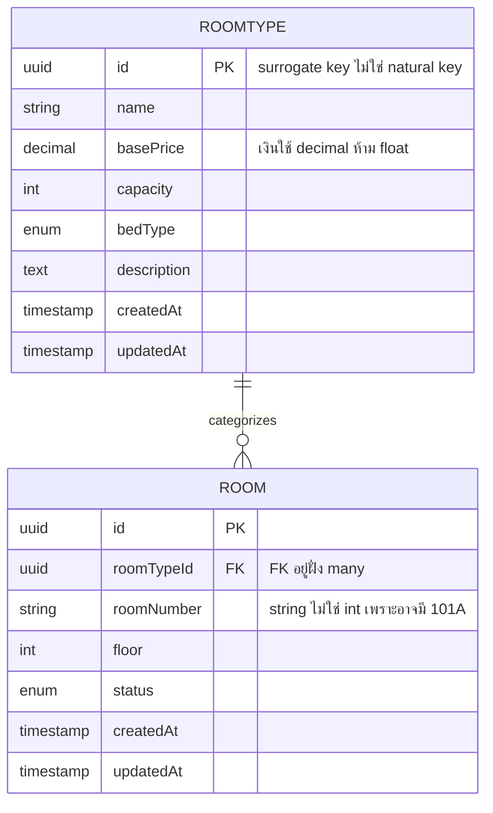
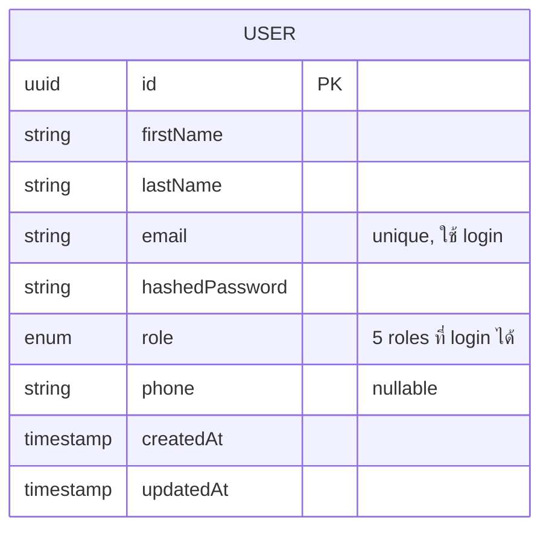

# LEARNINGS -- HotelHub

    บันทึกการเรียนรู้ในระหว่างการพัฒนา HotelHub

## Phase 0: Project Brief & Setup

    วันที่ 8 มิถุนายน 2026

### ได้เรียนรู้อะไรใหม่

- การวางแผนในการดำเนินงานตั้งแต่ขั้นตอนแรก (วาง Project Brief) จนถึงปล่อยงาน (Deploy Production) ว่าจะต้องคิดถึงเรื่องอะไรบ้างหรือมีปัจจัยอะไรบ้างที่มาเกี่ยวข้องในการทำขั้นตอนเหล่านี้ เช่น
    - ใครจะมาเป็น User ในระบบของเรา (Internal users and External users)
    - Killer features ของเราคืออะไรแล้วทำไมถึงเลือกทำ Feature นี้หรือมันแตกต่างจากของคนอื่นเขาอย่างไร
    - จุดอ่อนของตัวเราคืออะไร
    
    มันสำคัญมากเพราะเราจะได้เน้นเนื้อหาในส่วนนี้เป็นพิเศษ เพื่อให้เกิดการเรียนรู้และครั้งถัดไปจะได้ทำเป็นหรือมีประสบการณ์

- รู้จัก Trade - off ของการเลือกของมาทำงาน เช่น
    - การเลือก Tech stack ที่จะนำมาใช้งาน: มันจริงอยู่ว่า Tech อันนั้นก็ดีอันนี้ก็น่าสนใจ แต่ว่าการเลือกใช้จะไม่ได้เลือกแค่เพราะมันเท่หรือมันไม่เหมือนใครมาก่อน เราเลือกเพราะเราชั่งน้ำหนักดูแล้วเกิดความคุ้มค่ามากที่สุดในการทำงาน
    - การเลือกทำบาง Feature: แน่นอนว่าเว็บนี้เป็นของตัวเราเอง เราอยากจะทำอะไรหรือเพิ่ม Feature อะไรก็ได้ตามที่เราต้องการ แต่ แต่ แต่ ระยะเวลากับความเหนื่อยนี่มีมาให้เห็นแน่นอน เราไม่ได้เลือกทำ Feature เพราะแค่มันเท่ มันไม่เหมือนใคร แต่เราทำเพราะมันจำเป็นที่จะต้องมี (เป็น Core feature) และถ้าหากสุดท้ายแล้วเรายังมีเวลาเหลือมากพอให้เพิ่มได้อีก เราก็จะเลือกในสิ่งที่ลงมือน้อยแต่ได้ประสิทธิภาพมากที่สุด

    ทุกอย่างมันมีทั้งข้อดีและข้อเสียอยู่ในตัวของมันเอง แค่เราต้องรู้จักที่จะเลือกใช้ให้เหมาะสมกับการทำงานและเวลาของเรา โดยที่ไม่มี Bias ต่อ Tech ใดๆ เช่น อันนั้นไม่ดี อันนี้ไม่ใช่ อันนี้ดีกว่าอันนั้น เพราะฉะนั้นจงชั่งน้ำหนักของประโยชน์ของสิ่งต่างๆ ให้ดีก่อนที่จะเลือกมาใช้ เพื่อจะได้ไม่มานั่งปวดหัวทีหลัง

### ยังไม่มั่นใจ / อยากทำความเข้าใจเพิ่ม

- เรื่องการออกแบบระบบ เช่น เราควรจะมี Core features ขั้นต่ำอะไรบ้าง ถึงจะสามารถใช้ในการดำเนินการได้อย่างราบรื่น ปลอดภัยและไม่เป็น Scope creeps (มี Feature น้อยจนทำงานจริงไม่ได้) ด้วยความที่เรายังคงใหม่อยู่ ประสบการณ์ในการทำงานตรงนี้ก็ยังน้อยอยู่ เลยทำให้ตอนนี้หากมีการขึ้นโปรเจคใหม่ เราก็อาจจะยังอ้ำๆ อึ้งๆ ว่าควรที่จะต้องมี Core feature อะไรบ้าง แต่คิดว่าในอนาคตถ้าได้ลองทำอีกหลายๆ โปรเจคก็สามารถที่จะออกแบบได้ดีมากขึ้นแน่นอน

- Tech stack & Concept บางอย่างที่เราไม่เคยได้ใช้งานมาก่อน เช่น
    - Socket.IO ที่จะเอามาใช้ทำ Real - time dashboard
    - การรับมือกับ Race condition
    - การออกแบบ Auth strategy, Database
    - CI/CD ที่ยังคงมีประสบการณ์น้อยอยู่
    - การจัดการกับ Caching layer
    - การทำ Error tracking

    ซึ่งเหล่านี้ยังคงเป็นจุดอ่อนของเราในตอนนี้อยู่ แล้วเราคิดว่าการทำโปรเจคนี้จนแล้วเสร็จ ถึงจะใช้ AI ในการทำงานเป็นหลักควบคู่กับการอ่าน Code ทีละบรรทัดของเรา นั่นจะทำให้เราสามารถจดจำ Pattern และ Why? เพื่อนำไปใช้ในประสบกาณ์ในการทำงานจริงๆ ได้

    เราจะศึกษาและลงมือเขียนเองในทุกบรรทัด จะไม่มีการ Copy มาวางแล้วก็ข้ามไปขั้นตอนถัดไปโดยที่ไม่อ่านอะไรเลย เพื่อให้เป็นการศึกษาจากการทำโปรเจคจริงๆ ไม่ได้เป็นแค่การ Vibe coding เพียงเท่านั้น เราจะศึกษาให้ลึกและมากพอที่จะสามารถนำไปใช้งานในระดับ Production ได้จริง

## Phase 1: Database Design

### บทเรียน "ทำไม Room !== Roomtype"

ทำไมการเก็บข้อมูล Entity ROOMTYPE จะต้องแยกออกมาจาก ROOM ด้วย?

    นั่นเพราะเราอยากจะให้ข้อมูลมีแค่แหล่งเดียว (SSOT: Single Source of Truth) นั่นคือการแก้ข้อมูลแค่ที่เดียว ก็จะทำให้ข้อมูลจากอีกที่ที่เรานำไปใช้งานเปลี่ยนไปด้วย เพื่อลดความซ้ำซ้อนและการตกหล่นจากการทำงานที่ผิดพลาด

แล้วถ้าเราไม่ทำแบบนี้ล่ะ เราใช้แค่ Entity ROOM อันเดียวไปเลย ไม่มี Roomtype ไม่ได้หรอ?

    ลองคิดดูนะ ถ้าเรายัดข้อมูลที่ต้องการทุกอย่างลงไปใน Entity Room เช่น

    - เลขห้องพัก
    - ราคาห้องพัก
    - จำนวนผู้เข้าพัก
    - ชนิดเตียง
    - สิ่งอำนวยความสะดวกต่างๆ
    - คำอธิบายห้องพัก
    - และข้อมูลอื่นๆ

    แล้วเรามีห้องพักเยอะมาก นั่นคือจะเกิดความซ้ำซ้อนของข้อมูล (ต่างกันแค่เลขห้องแต่ข้อมูลอื่นๆ แทบจะเหมือนกันทั้งหมด) ถ้าหากวันหนึ่งเราต้องการที่จะแก้ไข้ราคาห้องหรือคำอธิบายห้องพัก เราจะต้องทำการ อัพเดต ข้อมูล ทุกห้องเลยที่ใช้ข้อมูลเดียวกัน ซึ่งมันมีโอกาสที่บางห้องพักอาจจะตกหล่นได้แล้วทำให้การแสดงผลของข้อมูลไม่เหมือนกัน ผิดพลาดและสับสนได้

ซึ่งการมาของ Entity Roomtype จะแก้ปัญหานี้คือ

    เราก็เอาข้อมูลที่คิดว่าน่าจะมีการแชร์ร่วมกันมาใส่ แล้ว refer ข้อมูลไปยังห้องพัก (Room) ที่ต้องการ เพียงเท่านี้การแก้ไขแค่ที่ Entity Roomtype ก็จะทำให้ Room ที่ผูกข้อมูลแชรฺเอาไว้ได้รับการแก้ไขไปด้วย ซึ่งมันง่ายกว่ามากๆ เพราะเราทำแค่ที่เดียวก็เสร็จเลย

### 3 เครื่องมือ ของ Logical Modeling

1. Column + Data Type
    
    แต่ละ Attribute จะกลายเป็น Column และในทุก Column จะต้องมี Type
    - string: ข้อความสั้นๆ (เช่น ชื่อ, Email)
    - text: ข้อความยาว (เช่น คำอธิบาย บรรยายต่างๆ)
    - integer: เลขจำนวนเต็ม (ชั้น, จำนวนคน)
    - decimal: เลขทศนิยมที่จะต้องใช้ความแม่นยำสูง (เช่น เงิน)
    - boolean: ค่าความจริง (จริง/เท็จ)
    - timestamp: วันเวลา
    - uuid: ID แบบสุ่ม
    - enum: ค่า preset ที่กำหนดเองแบบตายตัว (เช่น Roles, สถานะห้องพัก)

    **เงินจะต้องใช้ Decimal เท่านั้น** ห้ามใช้ float เด็ดขาด เพราะอะไร?

        ในคอมพิวเตอร์จะมีการปัดเศษซึ่งมีโอกาสที่จะเกิด Error ได้ (Rounding Error) เช่น 0.1 + 0.2 !== 0.3 ทั้งๆ ที่ในโลกของความจริงมันเท่ากัน แต่ในคอมฯ มันกลับไม่เท่ากัน! แล้วด้วยความที่มันคือเงิน การปัดเศษที่ผิดพลาดแม้จะค่า 0.1 บาท แต่มันก็มีโอกาสถมกันไปเรื่อยๆ จนขาดทุนหรือเกิดผลเสียร้ายแรงตามมาได้ เพราะฉะนั้นทุกอย่างที่เกี่ยวกับเงินจะต้องใช้ decimal เสมอ!

2. Primary Key (PK): Surrogate VS Natural

    ในทุก Table จะต้องมี PK หรือก็คือ Column ที่เอาไว้ใช้เก็บข้อมูลระบุตัวตนของแต่ละ Row ได้แบบไม่ซ้ำกัน เช่น ID

    และแน่นอนว่าในตาราง Room เราจะไม่ใช้ roomNumber (Natural Key: ข้อมูลจริงทางธุรกิจ) เป็น PK เพราะอะไร?
        
        ลองคิดดูว่าถ้าเราใช้ roomNumber เป็น PK ถึงแม้ว่าเราจะมีเลขห้องที่ไม่ซ้ำกันเลยในโรงแรมของเรา แต่ๆ ๆ ๆ ถ้าวันหนึ่งเรา Renovate โรงแรมแล้วจำเป็นที่จะต้องแก้ไขเลขห้องใหม่ทั้งหมด นั่นคือ roomNumber ของเราจะเปลี่ยน! แล้วอะไรก็ตามที่เคยชี้หรืออ้างอิงมาหา roomNumber ใหม่นี้ก็จะพักทั้งหมด! เพราะ Key ที่มีการอ้างอิงถึงได้ถูกแก้ไขจนหายไปแล้ว (นั่นคือเรากำลังเอาสิ่งที่สามารถเปลี่ยนแปลง แก้ไขได้ มาผูกเป็นตัวตนถาวร!)
    
    วิธีการแก้ไขคือเราจะใช้ Surrogate key:Key ที่ไม่มีความหมายอะไรเลยในทางธุรกิจมาใช้แทน คือมันจะเป็นการสร้าง column id (uuid) ที่สุ่มขึ้นมาซึ่งจะไม่มีวันเปลี่ยน (แต่ roomNumber เราก็ยังเก็บไว้อยู่ในอีก column อยู่นะ แค่ไม่ได้ใช้เป็น PK แล้ว นั่นคือเราก็สามารถเปลี่ยนแปลง แก้ไขเลขห้องได้แล้ว) มันจะนิ่งตลอดการและทุกอย่างที่อ้างอิงเข้ามาก็จะไม่มีวันพัง

        ใน Production App เราจะใช้ surrogate key (id) เป็น PK แทบจะทุกครั้ง
    
3. Foreign Key (FK) จะอยู่ฝั่ง Many เสมอ

    Relationship ใน Conceptual จะกลายเป็น FK column ใน Logical และถ้าดูจาก Diagram FK จะอยู่ฝั่ง Many (ROOM) เสมอ (ROOMTYPE ||--o{ ROOM) เพราะ

    - Room แต่ละห้องชี้ไปหา RoomType แค่ 1 อัน นั่นคือเก็บแค่ Column RoomTypeId แค่อันเดียว
    - แต่ถ้า RoomType 1 แบบชี้ไปหา (เก็บ) Room หลายห้อง นั่นคือจะต้องมีหลาย Row ใน 1 Column ซึ่งนั่นจะละเมิด 1NF ด้วย

นั่นคือ

- roomTypeId เป็น FK จะอยู่ในตาราง Room เพราะอยู่ฝั่ง Many (ไม่ใช่ RoomType) และจะชี้ไปที่ RoomType.id
- bedType และ status จะมี Type เป็น enum เพราะเป็นค่า Preset แบบตายตัวที่เราสามารถกำหนดขึ้นมาเองได้ เช่น status: Available / Occupied / Cleaning / Maintenance นั่นคือจะเป็นการลดข้อผิดพลาดจากการกรอกด้วยมือเองตลอดได้ (Database rejects)
- createdAt / updatedAt ควรจะต้องมีในทุกตาราง เพราะเป็น Audit Columns มาตราฐานที่ระดับ Production ใช้ เพราะจะได้รู้ว่าสร้าง event นี้หรือแก้ไขครั้งล่าสุดเมื่อไร
- ยังไม่มี Amentities เพราะมันเป็นแบบ Lists (คือมีหลายรายการ เช่น Wifi, TV, แอร์, ตู้เย็น, ...) การที่เราจะเอาสิ่งเหล่านี้ยัดลงไปใน 1 Column มันเป็นการละเมิด 1 NF

ข้อควรระวัง

- Naming Convention จะต้อง**เหมือนกัน**ทั้งโปรเจค (แม้ว่าจะยังอยู่ในขั้นตอนการวางแผนก็ตาม ทำให้เป็นนิสัยจะดีกว่า) นั่นคือ
    
        ถ้าจะใช้ camelCase ก็ใช้ให้เหมือนกันทั้งหมดหรือจะใช้ snake_case ก็ให้เหมือนกันไปเลย ยิ่ง Stack เป็น Prisma + TS จะมี Convention ให้ใช้ camelCase จะดีกว่า

- ใส่ **UNIQUE constraint** ใน Column ที่คิดว่า "จะไม่ให้มีการซ้ำกันแน่ๆ" เพื่อป้องกันการพังของข้อมูล เช่น Column Email ที่จะต้องมี 1 User : 1 Email เท่านั้น (ถ้ามี 2 Emails ที่ซ้ำกัน เวลา Login เข้ามา เราจะไม่มีทางรู้เลยว่าเป็นใคร)

- Nullability: Column ไหน "บังคับมี" Column ไหน "ไม่ต้องมีก็ได้" นั่นคือ
    - แต่ละ Column เป็น Required (NOT NULL) หรือ
    - Optional (Nullable)

    ลองคิดตามความจริงดู เช่น Column phone ที่ User บางคนไม่ได้อยากกรอก เพราะฉะนั้น phone ก็ควรที่จะเป็น Nullable (คือมีหรือไม่มีก็ได้ เผื่ออยากกรอกภายหลัง) แต่พวก email, hashedPassword, role พวกนี้จะต้อง Required คือจำเป็นที่จะต้องมี ไม่สามารถปล่อยให้เป็น Null ได้ ไม่งั้นจะไม่สามารถ Login หรือจัดสิทธิ์ได้

    แล้ว role = Guest ล่ะ เราจะจัดการยังไง จะเก็บข้อมูลเป็น Row ในตาราง USER ไหม? เพราะ Guest คือคนที่เข้าเว็บมาดูห้องโดยที่ยังไม่ได้ Login นั่นคือเขายังไม่มี Email และ Password เลยด้วยซ้ำ!?

        คำตอบคือ ไม่ต้องเก็บข้อมูล role = Guest ในตาราง USER เพราะว่า Guest = แค่คนดู ไม่ได้เป็น User กับเรา (คือไม่ได้ Register และ Login) เป็นสิทธิ์ที่ทำได้จำกัด แต่ก็ไม่ได้จำเป็นที่จะต้องเก็บข้อมูล
    
    เพราะฉะนั้นตาราง USER จะเก็บ role แค่ 5 ตำแหน่งเท่านั้น นั่นคือ
    
    - Customer
    - Frontdesk
    - Housekeeping
    - Manager
    - Admin

