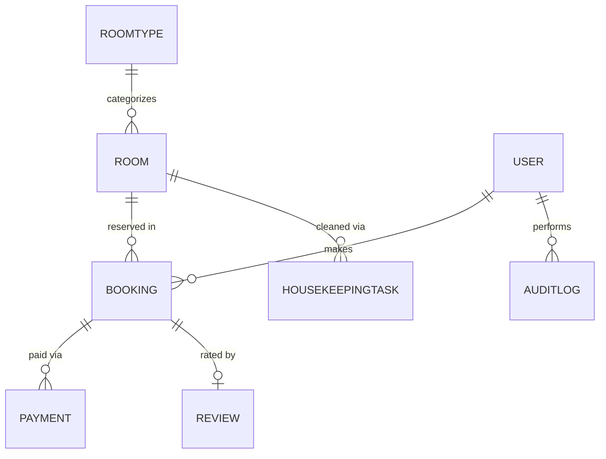

# 8 Entity ใน Project HotelHub

### 1. ROOMTYPE

คือ ชนิด/ประเภทและข้อมูลต่างๆ ที่เกี่ยวข้องกับห้องพักนั้นๆ ที่จะต้องใช้ข้อมูลเดียวกันเพื่อหลีกเลี่ยงการเกิดการซ้ำกันของข้อมูล เช่น
- ชื่อห้องพัก
- ราคาห้องพัก
- จำนวนผู้เข้าพัก
- ชนิดเตียง
- สิ่งอำนวยความสะดวกต่างๆ
- คำอธิบายห้องพัก
- และข้อมูลอื่นๆ ที่จะต้องใช้ซ้ำๆ กัน

เราแยกเก็บออกมาเป็นอีก entity เพราะว่า หากมีการแก้ไขข้อมูลห้องพัก จะสามารถแก้ไขได้สะดวกกว่าเพราะแก้ไขแค่ที่นี่ที่เดียว (เพราะแชร์ข้อมูลของห้องพักที่เป็นประเภทเดียวกัน) เป็น SSOT ด้วย

### 2. ROOM

คือ ข้อมูลของห้องพักที่เรามีจริงๆ ในโรงแรม เช่น ห้อง 101 - 110 โดยจะเก็บข้อมูลคือ
- หมายเลขห้องพัก
- ชั้น
- สถานะห้องพัก
- Foreign key ที่เชื่อมกับ Entity ROOMTYPE

### 3. USER

คือ ข้อมูล User ทุกตำแหน่งทั้งหมด 6 ตำแหน่งที่จะเข้ามาใช้งานในระบบของเรา นั่นคือ
- Guest
- Customer
- Frontdesk
- Housekeeping
- Manager
- Admin

### 4. BOOKING

คือ ข้อมูลการจองห้องพักจาก User: Customer หรือ Frontdesk ซึ่งจะมาจากการ Walk-in หรือ Online booking แล้วแต่สถานการณ์

### 5. PAYMENT

คือ ข้อมูลการชำระเงินที่เกิดขึ้นจาก User: Customer หรือ Frontdesk 

### 6. REVIEW

คือ ข้อมูลการรีวิวห้องพักจาก User: Customer

### 7. HOUSEKEEPINGTASK

คือ ข้อมูลที่เกี่ยวกับ งานการทำความสะอาด โดย User: Housekeeping

### 8. AUDITLOG

คือ ข้อมูลที่เก็บว่า User ใด ทำอะไร ที่ไหนและเวลาใด หรือก็คือเก็บประวัติการทำงานของ User แต่ละตำแหน่ง

# Conceptual diagram

